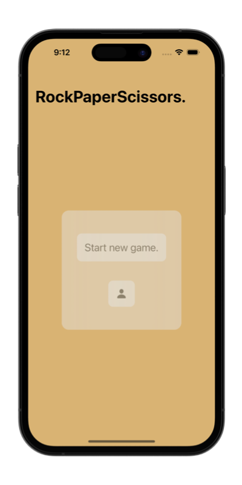
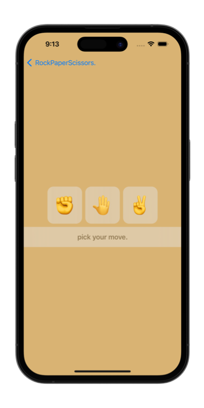
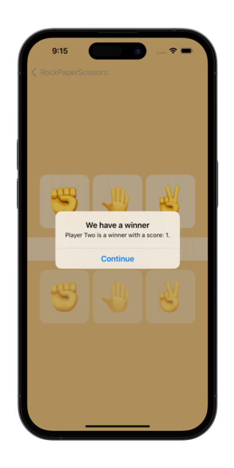

# &nbsp; Milestone 1

##### Author: *[MatviiArtemenko](https://github.com/100DaysOfSwiftUI-MatviiArtemenko)*

##### 100DaysOfSwiftUI form *[@twostraws](https://twitter.com/twostraws "twostraws twitter page")*

##### Follow along: *[100DaysOfSwiftUI](https://www.hackingwithswift.com/100/swiftui "Hacking with Swift")*

---
From *[100DaysOfSwiftUI :](https://www.hackingwithswift.com/100/swiftui "Hacking with Swift")*
> *You have a basic understanding of arrays, state, views, images, text, and more, so let’s put them together: your challenge is to make a brain training game that challenges players to win or lose at rock, paper, scissors. *
> So, very roughly:
> + Each turn of the game the app will randomly pick either rock, paper, or scissors.
> + Each turn the app will alternate between prompting the player to win or lose.
> + The player must then tap the correct move to win or lose the game.
> + If they are correct they score a point; otherwise they lose a point.
> + The game ends after 10 questions, at which point their score is shown.

---
## &nbsp; 🎖 Challenge
> So, very roughly:
> + Each turn of the game the app will randomly pick either rock, paper, or scissors.
> + Each turn the app will alternate between prompting the player to win or lose.
> + The player must then tap the correct move to win or lose the game.
> + If they are correct they score a point; otherwise they lose a point.
> + The game ends after 10 questions, at which point their score is shown.
 

---
## &nbsp; 📲 Screenshoot

  
  
  

---
##  &nbsp; 🔍 &nbsp; Resources 

* [Hacking With Swift](https://www.hackingwithswift.com/books/ios-swiftui)
* [Apple documentation](https://developer.apple.com/documentation/SwiftUI)
